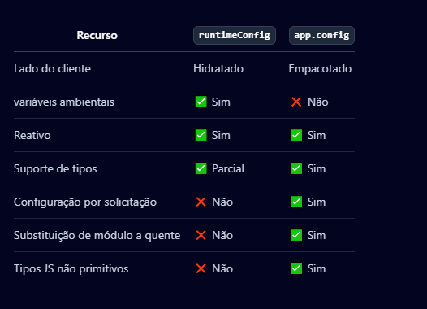

# Configuração

## Configuração do Nuxt

O arquivo `nuxt.config.ts` fica localizado na pasta raiz do seu projeto e pode sobrescrever ou extender o comportamento da aplicação.

Um arquivo de configuração mínimo exporta a função defineNuxtConfig contendo um objeto com sua configuração. O auxiliar defineNuxtConfig está globalmente disponível sem importação.

```js
export default defineNuxtConfig({
  // My Nuxt config
})
```

Esse arquivo será mencionado bastante na documentação, por exemplo, para adicionar um script customizado, registrar modules ou mudar a forma de carregamento.

## Sobrescrita de Ambiente

Você pode configurar substituições totalmente tipadas, por ambiente, no seu arquivo nuxt.config.

```js
export default defineNuxtConfig({
  $production: {
    routeRules: {
      '/**': { isr: true }
    }
  },
  $development: {
    //
  }
})
```

## Variáveis de Ambiente e Tokens Privados

O `runtimeConfig` API expoe valores como variáveis de ambiente para o resto da sua aplicação. Por padrão essas variáveis só estão disponíveis no ServerSide. As chaves dentro de `runtimeConfig.public` estão disponíveis também em ClientSide.

Esses valores devem ser definidos dentro de `nuxt.config` e devem ser sobrescritas usando variáveis de ambiente.

```js
export default defineNuxtConfig({
  runtimeConfig: {
    // The private keys which are only available server-side
    apiSecret: '123',
    // Keys within public are also exposed client-side
    public: {
      apiBase: '/api'
    }
  }
})
```

Essas variáveis são expostas para o resto da aplicação usando `useRuntimeConfig()`.

```js
<script setup lang="ts">
const runtimeConfig = useRuntimeConfig()
</script>
```

## Configuração de App

O arquivo `app.config.ts`, localizado na pasta source é usada para expor variáveis públicas que podem ser determinadas em tempo de build. Ao contrário de `runtimeConfig`, essas não podem ser sobrescritas usando variáveis de ambiente.

Um arquivo de configuração mínimo exporta a função defineAppConfig contendo um objeto com sua configuração. O auxiliar defineAppConfig está globalmente disponível sem importação.

```js
export default defineAppConfig({
  title: 'Hello Nuxt',
  theme: {
    dark: true,
    colors: {
      primary: '#ff0000'
    }
  }
})
```

Essas variáveis são expostas para o resto da aplicação usando a combinação `usaAppConfig`;

```js
<script setup lang="ts">
const appConfig = useAppConfig()
</script>
```

## runTimeConfig vs app.config

Como falado acima, `runtimeConfig` e `` são utilizados para expor variáveis para o resto da sua aplicação. Para determinar qual utilizar, aqui um guia:
* **runtimeConfig**: Tokens públicos ou privados que precisam ser especificados depois do build usando variáveis de ambiente.
* **app.config**: Tokens públicos que são determinados na hora do build, configurações do website, como definição de temas, título ou quaisquer configurações que não são sensíveis.



## Configurações Externas de Arquivos

Nuxt utiliza o arquivo `nuxt.config.ts` como a única fonte confiável para configurações e ignora a leitura de arquivos de configuração externos. Ao longo do processo de construção do seu projeto, você pode precisar configurá-los. A tabela a seguir destaca configurações comuns e, quando aplicável, como elas podem ser configuradas com o Nuxt.


Existem outras, consulte a documentação.

## Configuração do Vue

### Com Vite

Se você precisa passar opções para `@vitejs/plugin-vue` ou `@vitejs/plugin-vue-jsx`, você pode fazer isso no seu arquivo `nuxt.config`.

Exemplo:

```js
export default defineNuxtConfig({
  vite: {
    vue: {
      customElement: true
    },
    vueJsx: {
      mergeProps: true
    }
  }
})
```

### Com Webpack

Com webpack, se você usa webpack e precisa configurar o vue-loader, você pode fazer isso usando a chave webpack.loaders.vue dentro do seu arquivo nuxt.config. As opções disponíveis são definidas aqui.

```js
export default defineNuxtConfig({
  webpack: {
    loaders: {
      vue: {
        hotReload: true,
      }
    }
  }
})
```

### Habilitando Recursos Experimentais no Vue

Você pode precisar habilitar recursos experimentais no Vue, como propsDestructure. Nuxt fornece uma maneira fácil de fazer isso no nuxt.config.ts, independentemente do construtor que você está usando.


```js
export default defineNuxtConfig({
  vue: {
    propsDestructure: true
  }
})
```

Migração experimental de reactivityTransform desde o Vue 3.4 e Nuxt 3.9, Desde o Nuxt 3.9 e Vue 3.4, reactivityTransform foi movido do Vue para Vue Macros, que tem uma integração com o Nuxt.